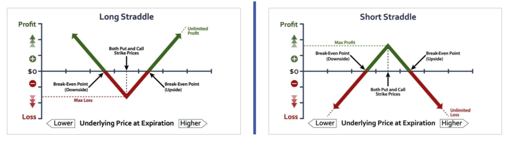
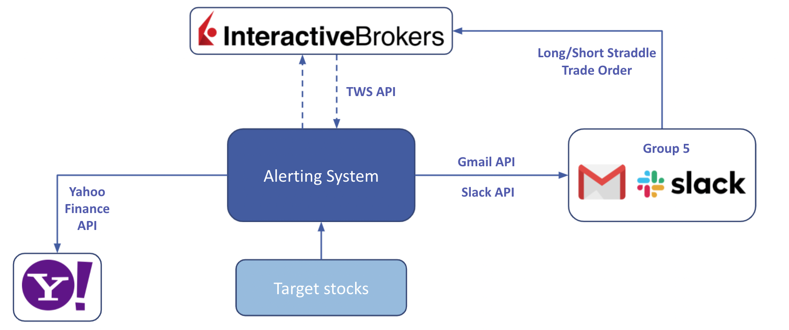
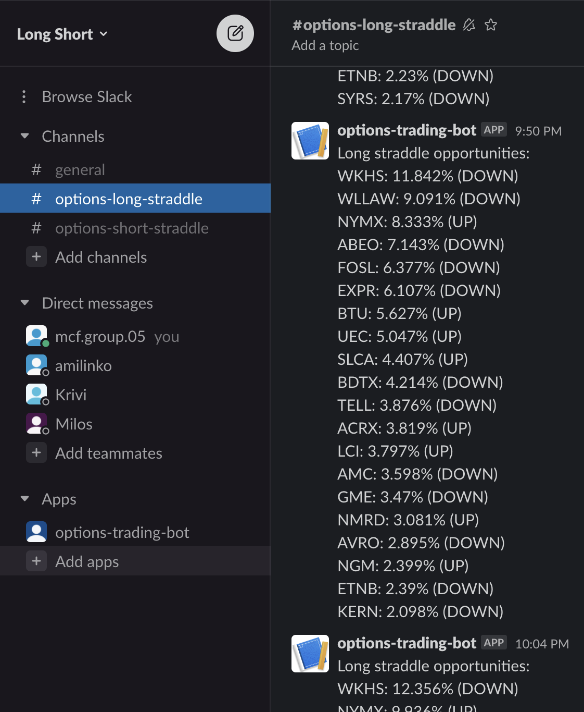

# Interactive Brokers: Volatility trading with options

[](https://github.com/mcf-long-short/ibkr-options-volatility-trading/actions/workflows/python-package.yaml)

## Introduction

`Volatility trading` using `equity options` and `long/short straddle` option strategies combined with a `momentum strategy` to profit from a high/low volatility on a daily level in the US equities.

For testing that strategy Interactive Brokers Trader Workstation was used with paper trading account. In order to quickly react on the market moves, simple `market watcher`/`trading bot` was implemented. `MarketWatcher bot` uses data from [Yahoo Finance](https://github.com/JECSand/yahoofinancials) and [Python TWS API](https://tradersacademy.online/trading-courses/python-tws-api).

This repository represents group project work for implementing option trading strategies (course in Financial Derivatives for advanced degree [Masters in Computational Finance, Union University](http://mcf.raf.edu.rs/)).

## Trading strategy

Our trading strategy is based on `volatility trading`. To exploit and profit from both the high and low volatility, we day traded - getting in and out of the positions in the same trading session. Some positions were held overnight as well.

In order to profit on a high or low volatility in the equities we traded `options` using `long straddle` and `short stradle` strategy respectively. For intuition about these strategies we highly recommend watching following videos:

- [Long Straddle](https://www.youtube.com/watch?v=4UlIMmXhjsc)
- [Short Straddle](https://www.youtube.com/watch?v=Lsk9ppb8ffs)

<p align="center">

</p>

## Trading Workflow

Firstly, we started with doing basic market research and finding `historically the most and least volatile stocks` in the past `1 week`, `2 week` and a `1 month` period in the `Russel 3000 index` (in order to capture both the large-cap and the small-cap companies). From those stocks we chose the top 50 stocks with highest and the top 50 lowest historical weighted volatility:
`Weighted volatility = 0.5 * Vol_1_week + 0.3 * Vol_2_week + 0.2 * Vol_1_month`.

Using naive expecation for the future volatility based on the historical volatility, combined with the momentum detected from the daily P&L for the target companies, we enter into `long straddle` or `short straddle` positions.

Our MarketWatcher bot was alerting us for all potential investment opportunities. From the provided list of `target stocks`, trading bot was sending us `alerts via Email and Slack`, when target stocks have `reached configured daily P&L threashold`:

- Long straddle - stocks with absolute daily P&L that are `greater` than `5% P&L threashold`
- Short straddle - stocks with absolute daily P&L that are `lower` than `0.5% P&L threashold`

Upon getting alerted by the MarketWatcher bot, we `hand picked` into which long and short straddle positions to enter.

<p align="center">

</p>

### Future improvements

In the next iteration of development we intend to ship more IBKR TWS API functionality so that daily P&L is fetched from there. We would also like to automate the whole process, by first adding support to our trading bot to place orders on TWS and after that to fully implement algotrading strategy.

## How to use MarketWatcher trading bot?

After cloning the repo, rename the `env.template` file to `.env` and populate it with your settings: `email notification interval time`, `daily P&L threashold values`, `email settings`, `slack channel webhook links`, ...

Create `.yaml file with target stocks` (ticker and long/short straddle strategy indicator for that ticker). MarketWatcher engine listens to real-time ticker data feed and notifies you when there is a `potential opportunity for entering into long or short straddle options position`, with that stock as an underlying.

You can control MarketWatcher trading bot using simple `CLI`. After bot is started it will send us an email/slack messages for each investment opportunity it finds.

CLI commands:

```bash
market_watcher_cli --help
market_watcher_cli start
market_watcher_cli stop
market_watcher_cli config
```

Example CLI output upon starting MarketWatcher engine:

```
         ______              _              _  _  _                 _
        |  ___ \            | |         _  | || || |      _        | |
        | | _ | | ____  ____| |  _ ____| |_| || || | ____| |_  ____| | _   ____  ____
        | || || |/ _  |/ ___) | / ) _  )  _) ||_|| |/ _  |  _)/ ___) || \ / _  )/ ___)
        | || || ( ( | | |   | |< ( (/ /| |_| |___| ( ( | | |_( (___| | | ( (/ /| |
        |_||_||_|\_||_|_|   |_| \_)____)\___)______|\_||_|\___)____)_| |_|\____)_|

        MarketWatcher tool for finding investiments opportunities on Interacive Brokers
        for volatility trading on equity market using long and short options strategy.

        version: v0.1.0


        Starting MarketWatcher...
        MarketWatcher started
        Reading target stocks from file: src/market_watcher/research/target_stocks.yaml
        Instantiating email notifier...
        Instantiating slack notifier...
        Instantiating MarketWatcher and running the engine
```

You can run cli tool from:

- Docker container (using docker-compose)
- Python virtual environment

### 1. Running in Docker

Building docker image:

```bash
docker build -t ibkr --rm .
```

Running CLI from docker-compose:

```bash
docker-compose run --rm mw market_watcher_cli start
```

### 2. Running in virtual environment

Install and activatre virtual environment for python 3.x:

```bash
python3 -m venv /path/to/new/virtual/environment
source .venv/bin/activate
```

Install requirements:

```bash
pip install -r requirements.txt
```

Install `ibapi` (client for IBKR TWS API):

```bash
# Installing ibapi
cd src/market_watcher/ib_client
python setup.py bdist_wheel
pip install src/ib_client/dist/ibapi-9.76.1-py3-none-any.whl

# Running ibapi tests
python -m unittest discover -s src/ib_client/tests
```

### Installing MarketWatcher trading bot:

```bash
cd src
pip install --editable .

market_watcher_cli start --help
```

### Slack requirements

In order to receive the investment opportunities from MarketWatcher bot as [Slack](https://slack.com/intl/en-rs/) messages, you must first create a new Slack app in your workspace and enable [Incoming-Webhooks](https://api.slack.com/messaging/webhooks). We expect to have two separate channels - one for receiving opportunities for a long straddle and the other for the short straddle strategies (see image bellow). Links for Slack webhooks need to be put in the `.env` file.

<p align="center">

</p>

### IBKR requirements

Requirements for enabling [Trader Workstation API](https://interactivebrokers.github.io/tws-api/):

- Download and install [Trader Workstation](https://www.interactivebrokers.com/en/index.php?f=14099#tws-software)
- Download and install [IB Gateway](https://www.interactivebrokers.com/en/index.php?f=16457)
- Enable following setting in the TWS (`File -> Global Configuration -> API -> Settings`):
  1. Enable ActiveX and Socket Clients
  2. Read-Only API (no order placing, only data reading for our scraping bot)
  3. Socket port: 7497 (Paper)/7496(Live)
  4. Allow connections from localhost only
  5. Create API message log file
  6. Logging Level: Error
- Download [TWS API source code](https://interactivebrokers.github.io/#)
